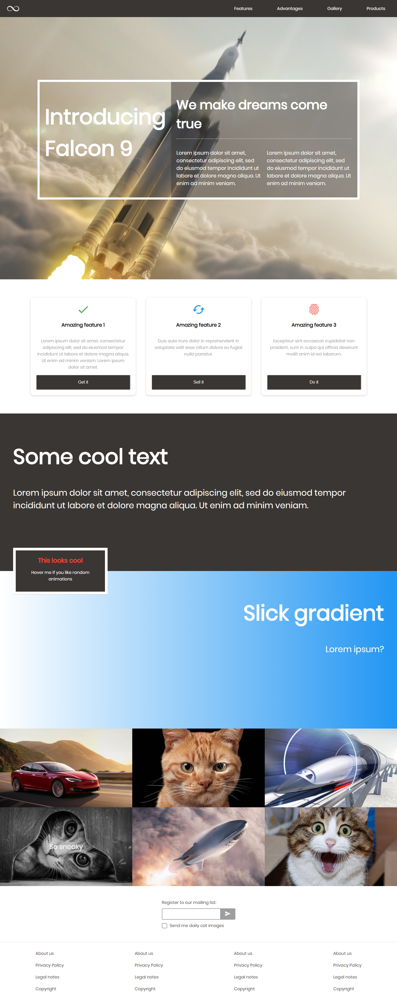
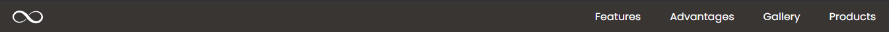

# Module 1 - Project - Build a webpage

## Description

Create an HTML file and a CSS file that reproduces a web page from the provided mockup.



## Instructions and tips to succeed

First and foremost, **read** this document carefully!

Here are a few guidelines to keep in mind:

### 1. Start by doing what you can

Take a moment to look at the different parts of the web page. Do you see anything that you would be comfortable doing?

- Can you create a black bar at the top of the page?
- What about creating a fullscreen background?
- There are 2 big sections with some text and a background color. Perhaps you do not know how to do gradient backgrounds, but you may know how to set a blue background color.
- The images have a zoom effect and a dark background with text showing up when you hover, perhaps trying to reproduce that whole behavior seems daunting. Try displaying images and creating the layout, you can **worry about the fancy stuff later**.
- There is a styled input box and checkbox around the bottom, perhaps you're not sure how to do that. If you get stuck trying to make it look the same, **focus on doing what you can** - a simple input and checkbox - and move on. You can come back to more troublesome parts later on.

### 2. Find a balance between struggling and moving on

Following the first point, it's fine to struggle on a feature which you want to achieve, but if you're exhausting all your energy on it while you could have spent some time doing things you know how to do, you should accept that **some parts should be tackled on at a later point**.

### 3. When you have a hammer, everything looks like a nail

- Maybe not the best use of this saying, but the point is that you should keep your mind open, there are many different solutions to a problem. Maybe you see something where flexbox would be very helpful, but after trying things out it's not as easy as you thought. That doesn't necessarily mean you're on the wrong track, but perhaps you should **try looking into a different solution if something you thought would be easy is taking much more time and effort than anticipated**. Again, balance between struggle and moving on.
- Don't be afraid to redo something if you realize the current solution won't work for a new feature. Perhaps you coded something that works and looks good, but when you try adding another feature it doesn't behave the way you expected. You may need to rethink your solution to accomodate new features.

### 4. I'm tired / feel lost / nothing is working

- If you end up feeling that way, sometimes the best remedy is to just take a step out for a few minutes, walk for a bit, think about something else. Many times, I ended up finding a solution or just a new perspective allowing me to move forward by stepping out and coming back with fresh eyes.
- It's normal to run into obstacles, it is part of the learning process. **If you're not struggling, you're not learning.**
- The instructor and the T.Cs are here to help **guide** you.

### 5. Where is the mobile mockup? Tablet?

Part of the project is to ensure that the page looks decent on mobile as well as desktop. It's generally better for this type of web page to consider mobile-first. The mobile version is generally easier to implement, and usually means less code overall.

You should also work section by section. e.g. create the mobile version of the nav, adjust the code for the desktop version of the nav, move on to the next section.

You will find a few gifs at the bottom of this file. They show what the mobile, tablet and widescreen versions should look like.

---

## Evaluation Criteria

You will be evaluated on the page you submit. Specifically, we will be looking at how close to the mockup your page is. To be clear, we are **not** looking for a pixel-perfect version, but close enough to not make the designer cry...

### Specifically

1. Desktop Layout (above `900px` wide)
   - fixed navbar
   - fullscreen image with header
   - Nothing is missing (all the sections are there, all the images, all the links, etc.)
2. Content
   - Assets/content are where they should be.
   - use of proper HTML tags (think semantic)
3. Mobile version (less that `768px` wide)
   - The page looks like the provided mockup.
   - All of the content is visible on mobile.
4. Animations and effects
   - At least 1 animation has been implemented. (zoom effect on image, underline hover effect on navbar links)

| Goal                      | Weight |
| ------------------------- | ------ |
| 1. Desktop Layout         | 40%    |
| 2. Content                | 20%    |
| 3. Mobile version         | 30%    |
| 4. Animations and effects | 10%    |

While your grade is based on the above criteria, it is also on the effort you put in.

The percentages above are only a guide as to where your efforts should be focused. The grade you receive for this project will not be a percentage but a `PASS`/`FAIL` attribution.

---

## Reference

Use the Poppins font from [Google Fonts](https://fonts.google.com/specimen/Poppins).

You don't have any of the actual external `url`s for the different links on the page. You can give all links the same `href`. Have all point to `href="#"`. \_If you don't add an `href`, the link will not render like a link on the page. (this does not apply to the nav, as it links to the different sections on the page.)

The website has a navbar with links that scroll smoothly to different sections of the page. To achieve this, you will need to specify an id on the different sections of the page (e.g. `<div id="features"></div>`) and you can then use an anchor tag to go to that section (`<a href="#features"></a>`).

You can use this CSS to have smooth scrolling:

```css
html {
  scroll-behavior: smooth;
}
```

We suggest using CSS variables for things like color (`#3a3633` is the primary color in this design, used for background color, text color) or **border-radius** (`4px`) so it's consistent across different elements. (If you take a look at the taxi activity we did yesterday, you will see how CSS variables are implemented.)

### Useful Properties

Here are some of the CSS properties used for the project (this is not a full list of the properties used, just the new or potentially confusing ones):

`background-color`  
You can use **rgba** to make transparent colors. **a** is the transparency value. e.g. `background-color: rgba(0,0,0,0.5);`

`object-fit`  
Size an  element like you would a background image, with properties like **cover** (automatically zoom in / out to cover the whole area), **contain**, etc.

`object-position`  
Can be used like the `background-position` property

`overflow`  
Specify the behavior of overflowing content (e.g. can hide overflowing content)

`-webkit-appearance: none`  
Some elements (e.g. checkbox input) cannot be styled. Using this CSS property, the functionality of the element is kept but the look of the element can be created from scratch. The _webkit_ prefix is to use the chrome implementation of the `appearance` CSS property.

`background-image`  
For gradient backgrounds, use `linear-gradient(direction, color1, color2)`. Example: `background-image: linear-gradient(to right, #fff, blue);`

`border-top-right-radius`  
You can specify `border-radius` on specific corners (top-left, top-right, bottom-left, bottom-right)

`transform`  
If you want to apply multiple transform effects (e.g. translate and rotate), the syntax is: `transform: translate() rotate()`

`transform-origin`  
Use this to specify from which point a transform should happen (e.g. scale from the left, center, or right of the element)

`transition`  
If you want to apply transitions on multiple properties, the syntax is: `transition: property_name duration easing_function, property_name2 duration easing_function`

`keyframes`  
Use to make animations. **from** is like `0%` and **to** is like `100%`. You can add as many keyframes as you want (e.g. `from{} 50%{} 80%{} 90%{} to{}`). You can also add keyframes in media queries, just use the same name to override the existing keyframe.

---

## Media queries

Use the following meta tag (put it first in the `<head>` section) to have the appropriate scale on all devices:

```html
<meta name="viewport" content="width=device-width, initial-scale=1.0" />
```

For this project, you will have ONE breakpoint: `768px`. Anything less than that is considered mobile, anything more is desktop. _This might mean that the page looks weird between `768` and around `900`._ That's fine. We're not focusing on a tablet verion.

Mobile-first design uses **min-width** rules for the media queries.

Put all your media queries at the bottom so they override your mobile CSS rules.

```css
/* Mobile styles */

@media (min-width: 768px) {
  /* Desktop styles */
}
```

## Notes

If your CSS rules are getting too complicated (e.g. `.myclassname > .someotherclass > div > span`) you should create new classes.

**ID**s are useful for section navigation but NOT for styling.

## Screenshot(s)

### Header



---

### Gallery


---

### Mobile Version


---

### Tablet Version


---

### widescreen Version


